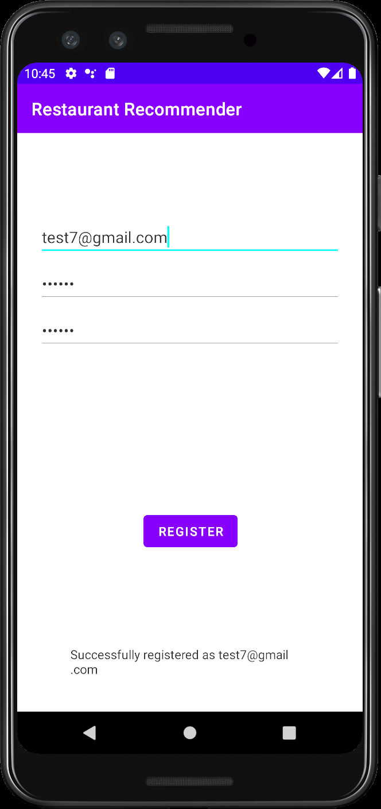
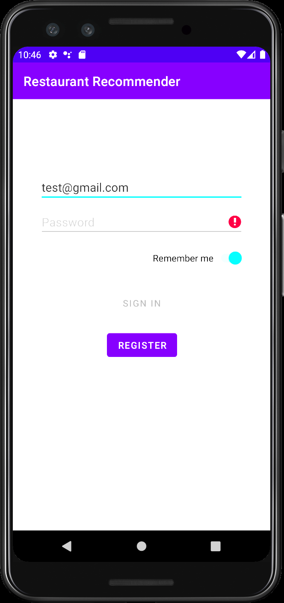
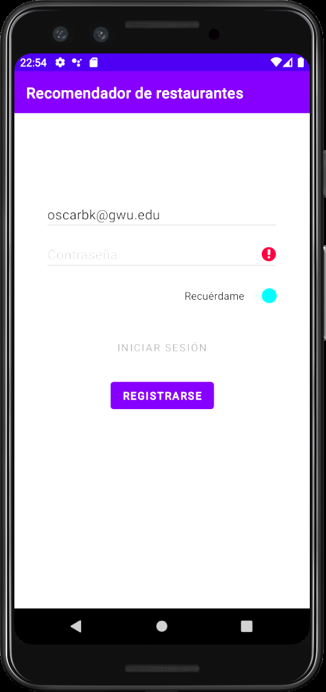
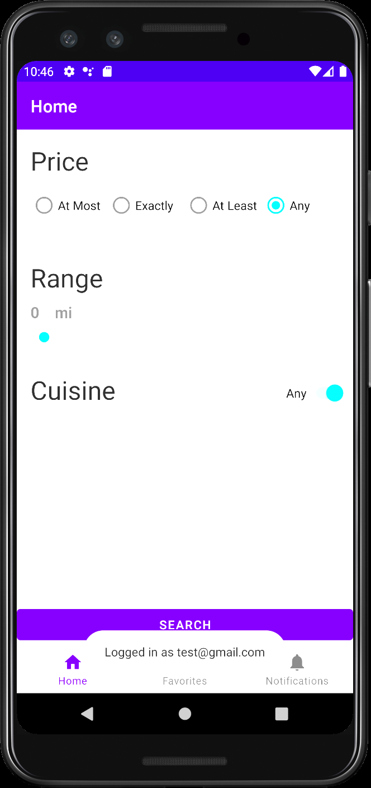
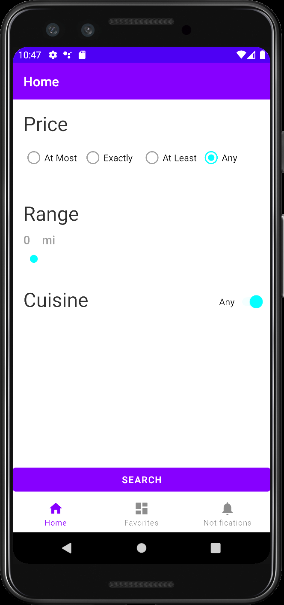
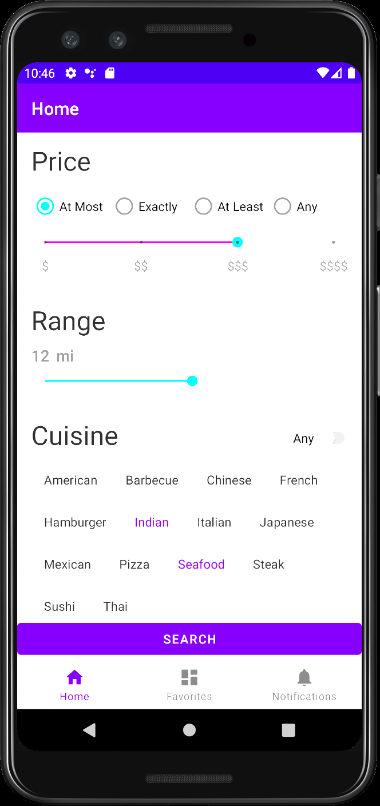
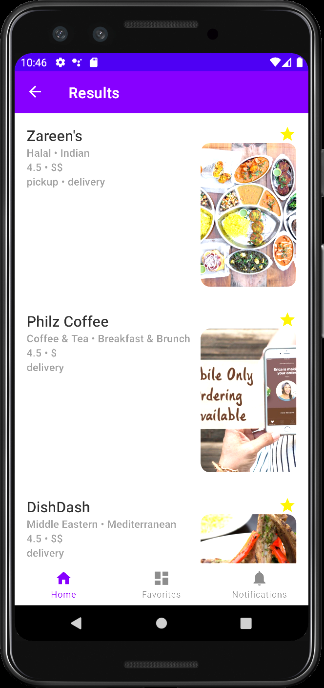
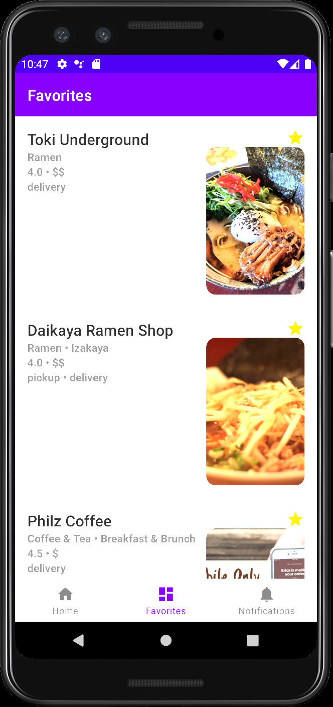

Android Restaurant Recommender is an app which recommends nearby restaurants to eat at depending on a user’s preferences. Restaurant results are sorted by reviews and clicking on a restaurant pulls up its Yelp page for additional information. It also keeps track of a user's favorite restaurants. Supports English and Spanish.

----

  
  
  
  

The user is initialy prompted with a screen where they can create an account using Firebase and sign in. Spanish is also supported based on the user's language preferences</>
 
----
 

  
  

Once signed in, the user can select a variety of filters to search for restaurants nearby</>
 
----
 

  
  

The user can view a variety of restaurants based on their search preferences. Tapping on the star icon will add the restaurant to the user's favorites tab. Tapping on a restaurants card view will take the user to that restaurants Yelp page, where they can see additional information such as reviews, hours, location, phone number, etc.</>

----
 
## TODO
* Ensure passwords are strong before user is allowed to sign up
* Set up a recyclerView for the recent picks fragment
